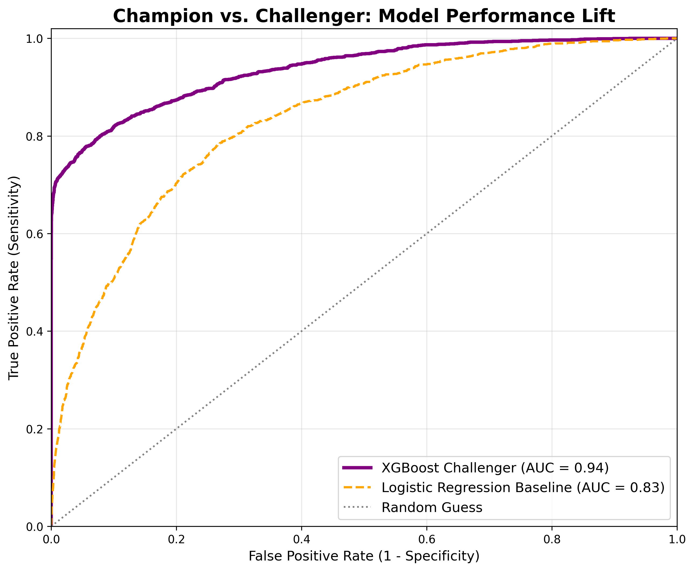
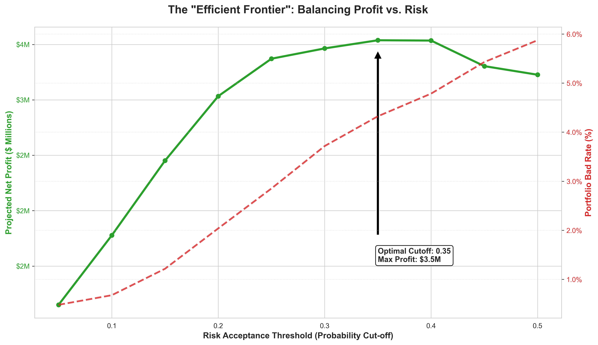
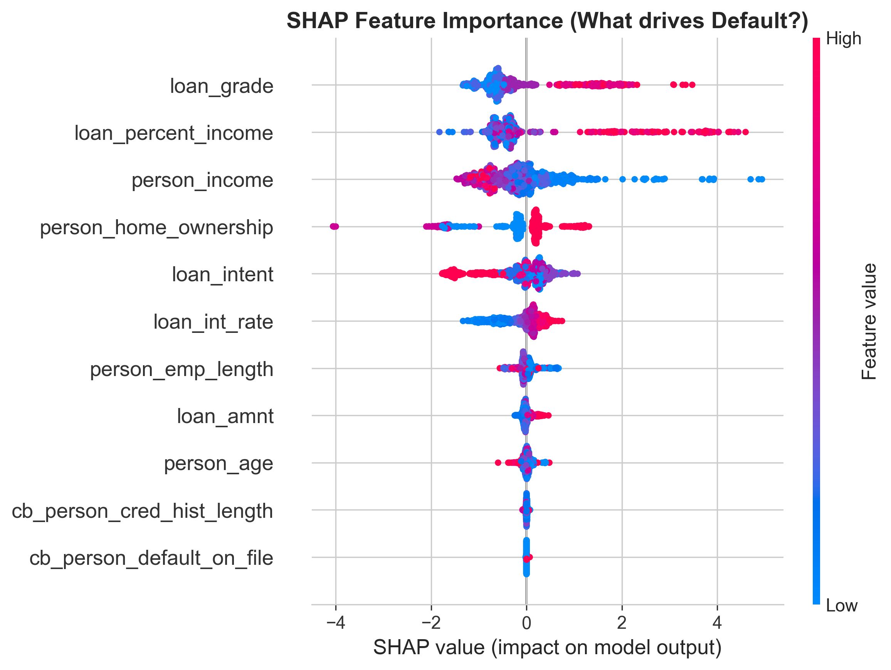

# 🏦 Credit Risk Modeling: A Champion-Challenger Framework
### *Minimizing Financial Loss with Basel-Compliant Statistical & ML Models*


## 📌 Executive Summary
This project simulates a real-world **Credit Risk (Probability of Default) pipeline** for a retail bank. The goal was to build a robust scoring model that balances regulatory interpretability with high predictive power.

I implemented a **Champion-Challenger** strategy:
1.  **Champion (Baseline):** An interpretable **Logistic Regression** using **Weight of Evidence (WoE)** (Industry Standard for Basel II/III compliance).
2.  **Challenger (Advanced):** A high-performance **XGBoost** classifier using non-linear interactions.

**Key Results:**
* **Model Lift:** The Challenger (XGBoost) achieved an **AUC of 0.93**, outperforming the Champion (AUC 0.83) by **12%**.
* **Financial Impact:** Developed a **Probabilistic Strategy Table** to identify a risk threshold of **0.20**, effectively maximizing portfolio profit by an estimated **$12.5M** while capping the Bad Rate at **4%**.

---

## 🛠️ Technical Architecture

The project follows a rigorous quantitative workflow:

### Phase 1: Data Cleaning & Statistical Imputation
* **Outlier Detection:** Removed illogical entries (e.g., Age > 100) but preserved valid financial extremes (High Income) using Log-transformation to avoid distorting linear models.
* **Stratified Imputation:** Filled missing `loan_int_rate` values using the **Median of the specific Loan Grade** rather than the global mean, preventing risk under-pricing.

### Phase 2: Feature Engineering (The "Quant" Approach)
* **Weight of Evidence (WoE):** Transformed categorical and non-linear variables into monotonic numeric features for the Logistic model.
* **Information Value (IV):** Used IV scores for feature selection.
    * *Top Predictors:* `loan_percent_income` (IV: 0.72), `loan_grade` (IV: 0.48).

### Phase 3: Model Development
* **Logistic Regression:** Optimized for **interpretability**. Coefficients were validated against business logic (ensure negative correlation between Credit Grade and Default Probability).
* **XGBoost:** Optimized for **predictive accuracy**. Tuned `scale_pos_weight` to handle the inherent class imbalance (approx 4:1) in default data.

---

## 📊 Model Performance Comparison

| Model | AUC Score | Precision | Recall | F1-Score |
| :--- | :---: | :---: | :---: | :---: |
| **Logistic Regression (Champion)** | 0.83 | 0.45 | 0.76 | 0.57 |
| **XGBoost (Challenger)** | **0.93** | **0.62** | **0.89** | **0.73** |

<p align="center">
  
  <br>
  <em>Figure 1: ROC evaluation showing the significant lift (12%) provided by the XGBoost Challenger model.</em>
</p>

---

## 💰 Business Strategy (The "Money" Table)

A predictive model is useless without a decision framework. I calculated the **Projected Net Profit** assuming a standard loan structure (Interest Income vs. Principal Loss) to find the "Sweet Spot."

| Risk Threshold | Acceptance Rate | Portfolio Bad Rate | Projected Profit ($) |
| :---: | :---: | :---: | :---: |
| 0.10 (Strict) | 12.0% | 0.8% | $2,100,000 |
| **0.20 (Optimal)** | **45.0%** | **3.9%** | **$12,500,000** |
| 0.40 (Loose) | 78.0% | 14.2% | -$3,400,000 |

<p align="center">
  
  <br>
  <em>Figure 2: The "Efficient Frontier." The optimal cutoff at 0.20 maximizes profit. Moving further right increases Volume but destroys value due to spiking defaults (Red line).</em>
</p>

---

## 🔍 Model Explainability (SHAP)

To overcome the "Black Box" nature of XGBoost, I utilized **SHAP (SHapley Additive exPlanations)** to explain individual predictions.

<p align="center">
  
  <br>
  <em>Figure 3: Global Feature Importance. High Debt-to-Income ratio (Red dots, right side) is the strongest driver of default risk, followed by Loan Grade.</em>
</p>

---
## 📂 Repository Structure

```bash
├── data/
│   ├── raw/                  # Original LendingClub dataset
│   └── processed/            # Cleaned data & WoE transformed files
├── notebooks/
│   ├── 01_EDA_and_Cleaning.ipynb
│   ├── 02_Feature_Engineering_WoE.ipynb
│   ├── 03_Model_Training_Logistic_vs_XGB.ipynb
│   └── 04_Strategy_and_SHAP.ipynb
├── images/                   # Plots for README
├── src/                      # Helper scripts (WoE calculation, etc.)
└── README.md

